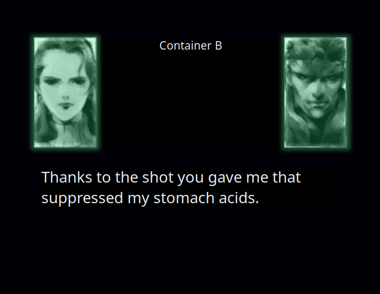

# Metal Gear Solid Codec app

A Metal Gear Solid inspired codec app. Client to client  communication software for video/audio calls, end-to-end encrypted, without the need for any server (not even for the initial connection). Intended to be minimalistic and just have the retro-nostalgic feel.

## Project Status
- [ ] Look and feel style
- [ ] Working controls (PTT, channels)
- [ ] Dynamic PTT / sound indicator
- [ ] Background eerie sounds
- [ ] Sound effects
- [ ] Camera input
- [ ] Local client to client connection
- [ ] Local network client to client connection
- [ ] Text input
- [ ] Voice comms
- [ ] Speech-to-text
- [ ] e2e encryption
- [ ] Comms over the internet
- [ ] Saved frequencies (contacts)
- [ ] Friendless mode (Talk to ChatGPT)
## Current look

